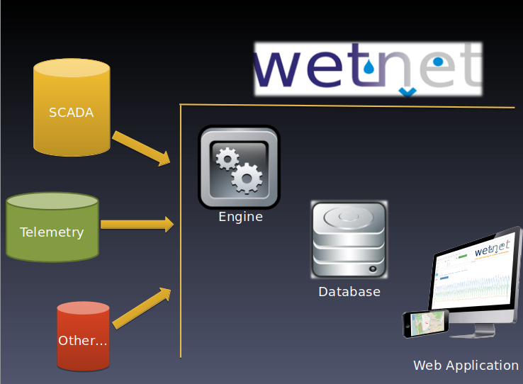
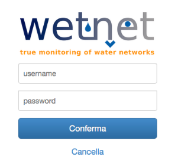

# WETNET Community Edition
# Installation Guide
The WetNet Community Edition (WetNet CE) software is composed by two different parts:
* Wetnet Engine
* Wetnet Supervisory Service (WSS)

The general architecture of Wetnet CE is represented in the following picture.

where the Web Application is the user front end of the WSS.

This guide provides you with all the necessary steps to perform a correct installation of the WetNet CE Software.

`DISCLAIMER: During all this guide the usernames and passwords provided are just an example and you should change them according to your preferences and needs, to avoid security issues to your systems.`

## OS and Software Requirements
In order to install correctly the WetNet CE Software you need to have the following requirements satisfied:

* Windows Server 2016 (64 bits)
* A web browser (like Firefox)
* A text editor (like Notepad++)
* Java JDK 1.8 (or later)
* Tomcat 8.5 (or later) available at http://tomcat.apache.org/download-80.cgi
* MySQL Server 5.7 (or later) available at https://dev.mysql.com/downloads/installer/
* MySQL ODBC Connector 5.3.4 (at the moment any other version is unsupported)
* MySQL Workbench (latest version)
* Connector J (latest version)
* Maven (latest version)

In this guide we assume that the database listening port number is 3306.

## Installation of Wetnet Engine (WetSvc)

Open with Workbench the database file  `src/WetNet-Engine/Database/WetDB.mwbWetDB.mw`. 
Click on the Workbench menu `Database → Forward Engineer` and leave the default parameters.  
If you want to have a `.sql` version of the database simply follow the automatic procedure to get it directly from WorkBench. 
At the end you should have the default Wetnet Engine Database created.  

The next step is to grant access to the database: in order to do that you need to create a `System DNS ODBC` (64 bits) via the Windows menu `ODBC Data Sources → System DNS → Add`.  
Fill the required fields with this configuration:
* Data source name : dsnWetNet
* Description: WetNet main database
* TCP/IP server: your server IP
* Port: 3306 (the database listening port)
* User: wet_user
* Pass: wet_user
* Database: choose wetdb2.

Remember to choose your own username and password.

Edit `bin/Engine/WetSvc/WetEngine.config` with the correct parameters: for example `dsnWetNet` as `WetDBDSN` and `3306` as `WebServicePort`. 
The configuration file must match the ODBC configuration.

Create the folder `bin/`, download the WetNet Engine zip from https://drive.google.com/open?id=1LSn5gmnkPexpQ2lt9HvyvD2gfz5kJS3h  unzip and place the files inside `bin/` folder.  
The downloaded files are `WetSvc.exe`, `WetLib.dll` and `WetEngine.config.xml`.

Open a terminal (cmd) and move into the `bin/` folder using `cd` command.

Install WetSvc with:

`WetSvc.exe -i`

and uninstall with:

`WetSvc.exe -u`

Check the log file produced to see if the procedure terminates correctly.

## Installation of Wetnet WebApp
Enough for the Wetnet Engine, let's move to the WSS.

1. Find your `CATALINA_HOME`, Tomcat root folder, usually `C:\Program Files\Apache Software Foundation\Tomcat 8.5`. 
In the `CATALINA_HOME/conf/catalina.properties` file Locate the row `shared.loader=` and add to it `${catalina.base}/shared/classes`, right after the `=`.

1. Create a new folder in `CATALINA_HOME` named `shared`, then another folder inside it named `classes`. Inside `classes` folder copy the `wetnet-configuration.properties` file. 
Set `wet_user` as `database.username` and `wet_user` as `database.password` (remember to choose your own username and password).  
Replace the IP used in `database.url` and `district.reset` with the correct IP. An example of wetnet-configuration.properties file is reported in the next section.  
Create `.jks` file with a terminal: move inside the `bin` folder of your Java JDK installation and then execute the command 
`keytool -genkey -keyalg RSA -alias selfsigned -keystore keystore.jks -storepass password -validity 360 -keysize 2048` 
Replace `password` with the chosen password and `keystore.jks` with the chosen path of .jks.

1. Edit the file `CATALINA_HOME/conf/server.xml` commenting the default connector for the 8080 port and adding the following new connector:
`<Connector port="8443" protocol="org.apache.coyote.http11.Http11NioProtocol" maxThreads="150" SSLEnabled="true" scheme="https" secure="true" keystoreFile="percorso/to/.jks" keystorePass="password" clientAuth="false" sslProtocol="TLS" />` 
replacing `keystoreFile` and `keystorePass` with the previous chosen parameters.

1. Deploy the application to produce the `.war` file. 
To deploy webapp simply run the following script:

        echo "-------------- Build wetnet-business -------------- "
        cd /path/wetnet-business
        mvn clean install -Dmaven.test.skip=true
        cd ..
        cd wetnet-web
        echo "-------------- Build wetnet-web -------------- "
        mvn clean install -Dmaven.test.skip=true

  Replace `/path/wetnet-business` with the absolute path to `wetnet-business` folder. 
  To run the script you need Java JDK (1.8 or later) and Maven. It’s recommended to setup enviromental variable `JAVA_HOME` pointing to the root folder of JDK.

1. Copy the `.war` file located in `wetnet-web/target/` inside `CATALINA_HOME/webapps`. Rename the file `ROOT.war` (deleting or renaming other .war already inside).  
Tomcat will deploy the .war and create a `ROOT` folder.

1. Now the beautiful part!  
Connect with a browser to the address https://IP:8443/wetnet/welcome, (where `IP` is the actual server IP). If a security exception is raised add the website to the trusted websites.  
At this point you should see the WetNet CE Home Page, as in the following picture.

 Login with default credentials:  `admin` as username and `admin` as password. 
Remember to change the credentials after your first login.

That’s it!

    NOTE: If an error occur when linking database to the webapp
    check with Heidi SQL → Tools → User Manager
    if wet_user has all the permissions on wetdb2 database.
    If he doesn’t, assign permissions to wet_user.

## Wetnet-configuration.properties
Below there is an example of the `wetnet-configuration.properties` file.

    database.driver=com.mysql.jdbc.Driver
    database.username=wet_user
    database.password=wet_user
    database.url=jdbc:mysql://1.1.1.1:3306/wetdb2
    district.reset.url=http://1.1.1.1:2315/ResetDistrictData
    district.reset.param1=id_district
    district.reset.param2=date
    district.reset.param3=check
    dashboard.zoom=10
    dashboard.map.center.latitude=43.662067
    dashboard.map.center.longitude=10.630779

## Open port for remote access
In most of the cases you want to grant external access to the platform. In order to do this you have to modify the `Windows Firewall` of your server.

Open Windows Firewall with `Advanced Security` and add one rule for `Inbound` and one rule for `Outbound` with the same configuration, as follows:
* Port `8443`
* TCP
* Set Allow Connections for all domain (Public, Private, Domain).

# WETNET WEB APP TRANSLATION
To translate WetNet CE WebApp into another language first locate the `.properties` file.

There are two copies of wetnet.properties. 
In `wetnet-business/target/classes` there is a copy created during the webapp deploy. 
In `wetnet-business/src/main/resources` there is the original file. 
Translate the values in the original `wetnet.properties` into desired language.

Finally, deploy the application following the procedure provided in the section `Installation of Wetnet WebApp`.

# License
EUPL v1.1
